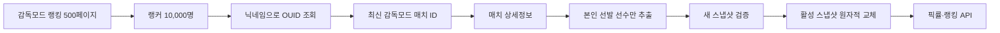

# FC-SUPPORT

> FC 온라인 감독모드 상위 랭커의 실제 선발 스쿼드를 수집하고, 순위·팀컬러·포지션 조건에 따라 선수 픽률을 계산하는 데이터 서비스입니다.

FC-SUPPORT는 포트폴리오를 목적으로 시작했지만, 실제 운영을 전제로 데이터 수집 안정성, API 호출량, 스냅샷 일관성, 실패 복구까지 설계한 풀스택 프로젝트입니다.

데이터는 임의로 생성하지 않습니다. 수집된 실제 데이터가 없거나 조회에 실패하면 `데이터 없음`, `수집 중`, `조회 실패` 상태를 그대로 표시합니다.

## 핵심 기능

- FC 온라인 공식 홈페이지의 감독모드 랭킹 1~10,000위 수집
- 랭커 닉네임을 NEXON Open API의 OUID로 변환
- 각 랭커의 최신 감독모드 경기 한 건 조회
- 상대 선수와 `SUB(28)` 교체 선수를 제외한 본인 선발 선수 저장
- 순위 범위와 팀컬러를 조합한 포지션별 선수 픽률 계산
- 시즌과 강화 단계가 다르면 별도 카드로 집계
- 선수 결과를 3명 단위로 조회
- 실제 감독모드 랭킹을 20명 단위 페이지로 제공
- 공식 CDN의 클럽 엠블럼·국가대표 국기·선수 이미지 사용
- 랭킹·구단가치·승률의 30일 시간별 이력 보관
- 매시 `05분 KST` 자동 갱신
- 한글 백엔드 로그와 웹 기반 임시 모니터링 화면

## 픽률 계산

예를 들어 선택 조건에 맞는 감독들의 LM 포지션 사용 선수가 총 6명이고, 특정 시즌·강화 단계의 데이비드 베컴을 2명이 사용했다면 다음과 같이 계산합니다.

```text
픽률 = 해당 선수 사용 수 / 해당 포지션 전체 사용 수 × 100
     = 2 / 6 × 100
     = 33.33%
```

선수 이름이 같더라도 시즌 또는 강화 단계가 다르면 별도로 집계합니다.

## 데이터 수집 흐름



갱신 중에는 기존 활성 스냅샷을 계속 제공합니다. 신규 데이터의 수집과 검증이 모두 완료된 후에만 활성 스냅샷을 교체하므로 이전 데이터와 새 데이터가 섞이지 않습니다. API 오류로 수집이 불완전하면 신규 스냅샷을 실패 처리하고 기존 데이터를 유지합니다.

## 기술 구성

- Frontend: React 19, Next.js App Router, TypeScript, vinext
- Backend: Node.js HTTP server
- Database: Node.js SQLite, WAL mode
- Data source: NEXON Open API, FC 온라인 공식 랭킹 페이지
- Styling: 반응형 CSS, 스포츠 데이터 에디토리얼 UI
- Scheduler: 매시 05분 KST 자체 스케줄러

## API

| 경로 | 설명 |
|---|---|
| `GET /api/health` | 백엔드 및 활성 스냅샷 상태 |
| `GET /api/team-colors` | 실제 수집된 팀컬러 목록 |
| `GET /api/pick-rates` | 조건별 포지션 선수 픽률 |
| `GET /api/rankings` | 감독모드 랭킹 페이지 |
| `GET /api/logs` | 최근 백엔드 로그 |
| `POST /api/admin/collect` | 관리자 수동 수집 시작 |

## 로컬 실행

요구사항: Node.js `22.13.0` 이상

```bash
npm install
```

`.env.example`을 `.env`로 복사한 뒤 새로 발급한 NEXON Open API 키를 입력합니다.

```env
NEXON_API_KEYS=KEY_1,KEY_2,KEY_3
```

API 키는 저장소에 커밋하지 않습니다.

프론트엔드와 백엔드를 각각 실행합니다.

```bash
npm run dev
npm run backend
```

- Frontend: `http://localhost:3000`
- Backend: `http://127.0.0.1:8787`

DB가 비어 있고 API 키가 설정되어 있으면 백엔드 시작 직후 최초 수집을 자동으로 시작합니다.

## AI와 함께 개발한 프로젝트

이 프로젝트는 AI를 단순 코드 자동완성 도구가 아니라 설계·구현·검증을 함께하는 개발 파트너로 활용해 만들었습니다.

AI와 함께 수행한 작업:

- 비정형 랭킹 HTML 요청과 응답 구조 분석
- NEXON Open API 호출 흐름 설계
- 다중 API 키 작업 큐와 재시도 처리 구현
- 스냅샷 기반 무중단 데이터 교체 설계
- SQLite 스키마, 수집기, 조회 API 구현
- 프론트엔드 UI와 실제 데이터 연동
- 실데이터 수집 결과와 계산식 교차 검증

프로젝트의 기능 정의, 집계 기준, 예외 처리 정책과 최종 의사결정은 직접 수행했습니다. AI가 만든 결과를 그대로 사용하는 대신 실제 API 응답과 DB 집계 결과를 반복적으로 확인하며 수정했습니다. 이 저장소는 AI를 잘 활용하는 개발자가 아이디어를 실제 동작하는 제품으로 구체화하는 과정을 보여주기 위한 포트폴리오입니다.

## 데이터 및 권리 고지

Data based on NEXON Open API

FC-SUPPORT는 NEXON Korea의 공식 서비스가 아니며, NEXON Korea의 보증이나 제휴를 받지 않습니다. 게임 데이터와 이미지에 관한 권리는 각 권리자에게 있습니다.
