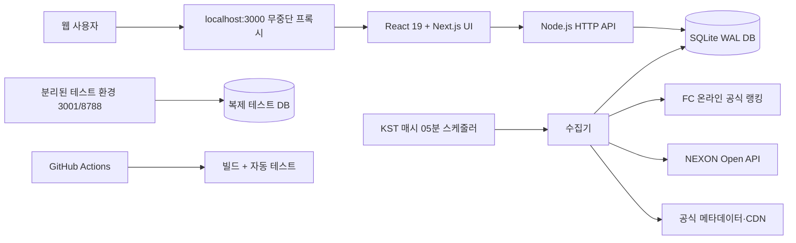
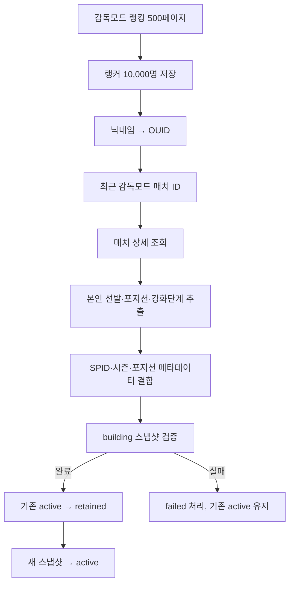
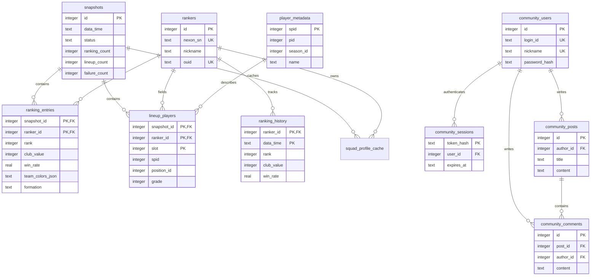

# FC-SUPPORT 아키텍처

## 목표

FC-SUPPORT는 FC 온라인 감독모드 상위 10,000명의 실제 데이터를 한 시간 단위로 수집하면서도 조회 사용자가 수집 중인 불완전한 데이터를 보지 않도록 설계했습니다. 프론트엔드 요청은 NEXON API를 직접 호출하지 않고, 검증이 끝난 활성 SQLite 스냅샷만 조회합니다.

## 시스템 구성

## 수집 파이프라인

- 여섯 개 API 키는 작업 큐에서 함께 사용하지만, 최종 결과는 하나의 스냅샷으로 묶습니다.
- 서버 재시작으로 중단된 `building` 스냅샷은 실패 처리하고 활성 스냅샷을 유지합니다.
- 활성 스냅샷은 한 개, 복구용 이전 스냅샷은 한 개만 남깁니다.
- 순위·구단가치·승률 이력은 30일 동안 별도 보관합니다.

## DB ERD

## 일관성과 장애 대응

1. SQLite는 WAL, foreign key, busy timeout을 활성화합니다.
2. 수집은 DB 잠금으로 중복 실행을 방지합니다.
3. 새 스냅샷은 모든 단계가 끝날 때까지 사용자 조회에서 제외됩니다.
4. 승격은 하나의 트랜잭션에서 수행합니다.
5. 테스트 환경은 운영 DB의 SQLite 스냅샷 복제본을 사용합니다.
6. 배포는 새 서버의 빌드·테스트·헬스체크가 끝난 후 프록시 연결만 전환합니다.

## 인증과 커뮤니티

- 비밀번호는 Node.js `scrypt`와 사용자별 salt로 해시합니다.
- 세션 원문은 DB에 저장하지 않고 SHA-256 해시만 저장합니다.
- 브라우저에는 `HttpOnly`, `SameSite=Lax` 쿠키를 사용합니다.
- 게시글과 댓글은 공개 조회이며, 작성은 로그인 회원만 가능합니다.
- 삭제 권한은 UI가 아니라 서버에서 작성자 ID로 다시 검사합니다.
